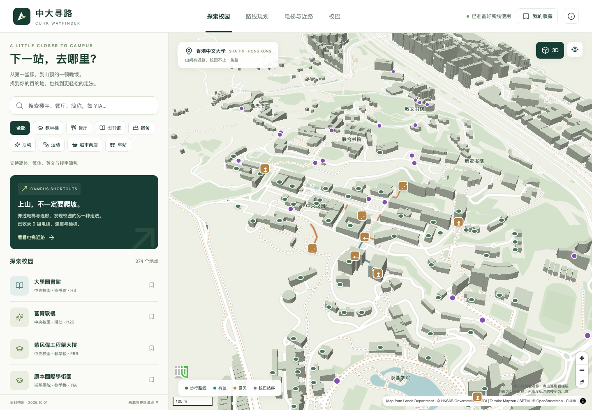

# 中大寻路 · CUHK Wayfinder

香港中文大学校园导航网站：找到教学楼、活动中心、宿舍、餐厅、图书馆、运动场所及商店，并比较穿楼近路、户外步行和校巴接驳。

**网站：<https://collapsar11.github.io/cuhk-wayfinder/>**  
**源码：`main`；编译产物：`gh-pages`。** 独立开发，非中大官方应用。公开资料快照：2026-10-01（香港时间）。



## 已实现

- **374 个可搜索地点（345 个地点 / 入口 + 29 个运营线路途经站点）**，简繁体、英文、楼宇简称搜索，按用途筛选，收藏保存在本机。
- **3D 地形与楼宇**：MapLibre GL、本地 OSM 建筑轮廓、Mapzen/SRTM 地形；可旋转、缩放及切换 2D。缺少建筑高度时使用示意体块，并非摄影测量实景模型。
- **9 组有来源的电梯、连廊与楼梯**：原有三组电梯及 YIA 扶梯/连廊，新增 LSB LG1—SHB 5/F、SHB 5/F—ERB 9/F 连廊，以及中央校园接驳楼梯、校友径楼梯、新亚梯。电梯上下层拆成不同节点，计算等候和乘梯时间；扶梯遵循公开方向标记。
- **研宿一座 → 邵逸夫堂 → SHB 5 楼**：近路页可一键预填，按当前时刻表计算 2S / H / N 等班次，保留指定上落站的连廊路线。地图计算外侧楼梯接驳；LSB 楼内到 LG1 的电梯走法提供校方指引，楼内详细几何尚未测绘。
- **点击建筑显示名称**：2D / 3D 建筑轮廓及地点标记可打开名称、英文简称及相关连廊。手机点击后留在地图。支持 LSB 等带中庭的多边形建筑；缺乏可靠名称的轮廓明确显示待补充。
- **两套独立步行路网**：OSM 配合官方近路指南；地政总署 CSDI 三维行人路网保留 XYZ 和坡度，作为另一条备选路线，展示累计上升。三维数据来自 4,469 条路段，排除 18 条开放时段尚未解析的路段。
- **12 个免费校巴编号、18 种服务班次、57 个原始站点记录**：按香港时间、公假、教学日、周六和条件停站计算；比较接驳步行、候车、乘车及转乘。非 CU BUS 实时定位。校巴页独立展示 2（停邵逸夫堂）、5 / 6A / 7（星期六）、8（非教学日）、H（停39区）六种特殊班次，并显示各自时段和站序；路线比较保留可行校巴方案，即使它比步行慢。各班次类型另保留可行的直达校巴，避免只显示最快线路而隐藏 8 号线等备选。
- **环回东临时站和敬文 can**：PGH1 可步行到环回东上行临时站，搭 8 号线到敬文书院。迁站作为坐标变更处理，保留 4 / 8 上行和 8 下行服务；坐标由公告示意图近似定位，路线注明按现场站牌上车。车站可搜索、点击地图查看。
- **36 家餐厅的结构化营业资料**：每周时间、公假、特殊营业安排和参考价格来自 ueatwhat；状态是时刻表推算。
- **手机布局和离线使用**：首次完整缓存后，搜索、地图和路线计算可离线使用。支持添加到主屏幕；外部链接需网络。主动点击才请求定位，GPS 不上传，也不会写入分享链接。

## 本地运行

新增舒适路线比较：同时保留较快、避晒、少爬坡、电梯及校巴方案，默认按舒适偏好排序，也可按耗时排序。即使等电梯更慢，也不会删除可行的电梯备选。几何相同的路线合并标签，所有候选都可以点击查看地图和步骤。

路线卡片展示有盖、露天、遮蔽未知距离、已知步行爬升、高程资料覆盖、楼梯和电梯次数。“有盖”来自屋顶/室内标记，不代表树荫实测。SunCalc 1.9.0 根据出发时太阳高度调整日晒权重，夜间不加日晒惩罚，也可选择烈日或关闭日晒。分钟数与舒适排序分数分开，电梯/扶梯的上升不计入徒步爬升。地图青色为已知有盖，黄色为已知露天。

OSM 未注明坡度的地面步道使用本地地形高程粗估，像素地面分辨率约 35 m；排除穿楼、桥梁、隧道和标明楼层的路段。这不代表精确台阶或楼层测量；卡片会标注粗估及未知比例。

需要 Node.js 22.12+ 或 24（验证环境：Node 24），npm。

```sh
npm ci
npm run dev
npm test
```

生产构建与 GitHub Pages 子路径预览：

```sh
BASE_PATH=/cuhk-wayfinder/ npm run build
BASE_PATH=/cuhk-wayfinder/ npm run preview -- --port 4173
```

打开 `http://localhost:4173/cuhk-wayfinder/`。根目录部署时不设置 `BASE_PATH`。构建会生成 `dist/sw.js` 和 `.nojekyll`；Service Worker 预缓存本版本的完整静态资源，成功后显示“已准备好离线使用”。

端到端验证（首次安装 Chromium）：

```sh
npx playwright install chromium
node scripts/verify-site.mjs
# 可验证真实部署：
SITE_URL=https://collapsar11.github.io/cuhk-wayfinder/ node scripts/verify-site.mjs
```

检查包括桌面/手机、搜索、带电梯路线、设置失效处理、12 条校巴、3D 画布、页面错误/HTTP 错误、断网重载后搜索与路线；截图输出到 `docs/screenshots/`。浏览器测试不等于校园现场实测。

## 发布

初次在仓库 **Settings → Pages** 选择 `Deploy from a branch`，分支 `gh-pages`、目录 `/ (root)`。项目已按此方式发布。后续更新先在 `main` 提交，再执行：

```sh
npm run deploy
```

脚本先测试、编译，然后推送 `main`，将 `dist/` 同步到临时检出的 `gh-pages` 并提交推送。它不会强制推送，不会把依赖或原始下载文件发布到 GitHub。`scripts/github_api.py` 可通过现有 Git credential helper 调用 GitHub REST API；不保存或打印凭据。

## 路线模型及边界

1. OSM 路网用 Dijkstra 搜索；普通步速 75 m/min，楼梯 40 m/min，扶梯按 45 m/min 模型估算。显式坡度和可用的地形高程粗估增加上坡耗时。电梯默认等待 1.5 分钟，可改为 0.5、3 或 5 分钟。三组电梯乘梯时间以跨层数估算。穿楼与未知楼层不套用地面高程；缺失数据保留为未知。
2. CSDI 备选路网独立计算，以约 1 mm 的经纬度舍入、1 cm 高程区分节点。**不将两套地图按平面距离强行拼接**。交叉但不同高程的节点保持分离；数据中断开的路段不会凭空补连。
3. 楼宇坐标不是具体入口。地点吸附到主要连通路网最近节点，最大 120 m；两端接驳用虚线显示，仍需核对入口。关闭近路时重新建立户外连通图。这个步骤不包含室内定位，也可能漏掉较小连通分量。
4. 校巴发车取自官方 2026-09-01 时刻表；中途运行时间按相邻站直线距离 × 1.35、250 m/min 和停站余量估算。上车预留 1.5 分钟，每段步行接驳不超过 12 分钟，最多搜索未来 3 小时、候车不超过 90 分钟。结果是在该模型下较快，不能保证实时最优。
5. 2026 年公假已导入；2027 年公假未核实，故 2027 年日期仅提供步行，即使学期范围已收录。临时迁站的环回东站 62/63 暂不安排上下车；收费小巴未纳入计算。访客不推荐免费校巴。
6. 电梯门禁、开放时间、设备状态、施工及部分楼层连接尚未现场验证。“避开已知楼梯”不等于经过无障碍认证。无法连通时显示无路线，允许转到 Google Maps 独立核对。
7. 两套步行图的覆盖率、坡度资料不同，耗时只能作为模型估算比较。中大室内三维模型没有完整公开覆盖；本版本不是逐层室内导航。

## 数据与维护

运行网站只需仓库中的 `public/data`；不需要原始下载、API Key 或后端。详细来源、许可和更新流程见 [数据说明](docs/DATA.md) 和 [第三方署名](THIRD_PARTY_NOTICES.md)。

本机大文件位于 `/Volumes/H/cuhk-wayfinder/`，`data/raw` 是指向原始资料的本地链接，已被 Git 忽略。换机器不需要这个目录即可构建；只有更新原始资料时才需要下载。

关键代码：

| 文件 | 用途 |
|---|---|
| `src/main.js` / `style.css` | 地点、路线、餐厅、校巴和手机界面 |
| `src/map.js` | 3D 地图、本地地形、路线图层 |
| `src/routing.js` / `route-worker.js` | 步行图、时刻表、换乘搜索 |
| `src/food.js` / `search.js` | 营业时间与简繁搜索 |
| `scripts/build-*` | 数据编译、离线缓存 |
| `tests/` | 路线、方向、跨层、公假、营业时间测试 |

原始应用代码使用 MIT；OSM、CSDI、学校、餐厅和地形数据保留各自权利与条款，不能将代码许可证套用于这些数据。
